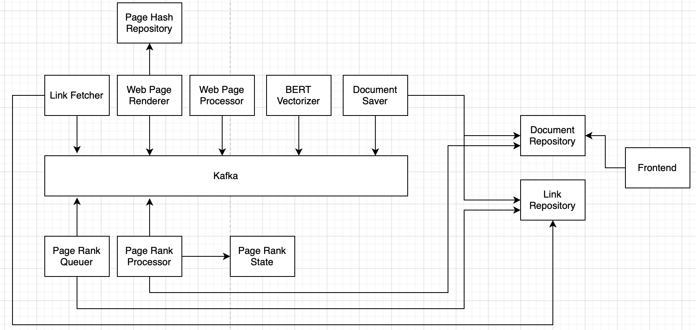

# README

### **Why build this? What's new here?**

- It’s my attempt to cover development of a real world product end to end. I have learned a lot while working on this and I expect that to continue.
- A bigger goal is to have good onboarding documentation, videos so that new devs benefit from it. I want them to have access to a fully working, thoroughly tested and complex product running in production. Open access to knowledge is my top priority.

### **Why choose Go?**

- Simplicity
- Strongly typed and compiled
- Fast and lightweight
- Encourages good coding practices
- Easy to deploy

### **Where is it deployed? Can I use it?**

It’s not deployed anywhere right now, I’m still coding the services. It’s a work in progress.

### **What's the high level architecture?**

- **LinkRepository** - Each webpage links to other webpages, forming a graph. This repo stores webpages and their links between them in the form of (source, destination) using CockroachDB
- **DocumentRepository** - Each webpage is a document with text in it. This repo uses Elasticsearch save all documents and index them for searching later on.
- **PageHashRepository** - Stores a hash of all processed documents and links. It helps avoid processing duplicate pages.
- **FrontendService** - Provides a REST API endpoint for searching links and submitting new ones.
- **LinkFetcherService** - Gets new links from the LinkRepository and adds them to a Kafka topic for processing.
- **WebPageRendererService** - Takes a link and returns contents of the rendered webpage. It needs to support static and dynamic webpages, which is why it’s an entirely separate service.
- **WebPageProcessorService** - Takes a rendered webpage and extracts links/text from it.
- **BERTVectorizerService** - Takes the text from the processed webpage and produces a vector for it. This vector will be used by Elasticsearch to rank search results along with the PageRank score.
- **DocumentSaverService** - Gets all fully processed documents from Kafka and saves them to DocumentRepository
- **PageRankQueuer** - Finds unprocessed documents in the current iteration and lines them up in a Kafka topic.
- **PageRankProcessor** - Takes an unprocessed document from Kafka and computes it’s new PageRank score. If the document has links to more documents in it, those documents are also added to a Kafka topic for processing. It’s Breadth First Search Algorithm at work here.
- **PageRankStateRepository** - Stores variables like iteration number, residual value for current iteration, etc that are needed for the PageRank algorithm. Uses Redis for fast queries.

Kafka acts as a glue for the whole operation. Each service takes data from a topic, processes it and puts it back into another topic. The services are all independent of each other, each keeps doing their job regardless of what the other services do.

### **How can I run this locally?**

Not right now, but the goal is to make it super easy to run this locally with a single docker-compose file. It’s a work in progress.

### **Can I contribute to this project?**

Feel free to create a PR, I’m more than happy to review and merge it.

### **What's the long term goal for this search engine?**

- Onboarding videos and documentation
- Clean code, full test coverage and minimal tech debt
- Autocomplete
- Use AWS for hosting all services
- Support for image indexing and search
- Terraform support
- CI/CD with Github Actions
- Sign-in with Google OAuth2
- User Activity Tracking using URLs
- React Frontend
