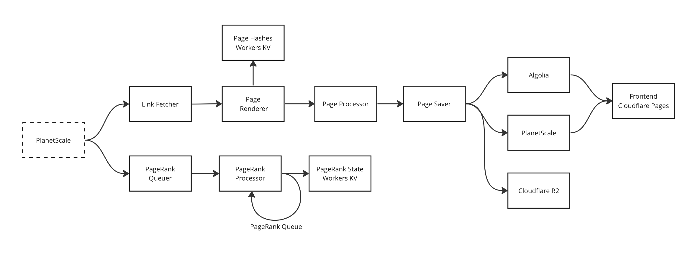

# README

This is my attempt to build a complex system, learn new things and share everything along the way. Here are my goals:

- Build a fairly complex product that can scale
- Have the best readable code and documentation
- Share this with everyone through articles/videos

This book taught me the foundational architecture to get started: **Hands On Software Engineering with Go.** After that, I have modified the architecture by a lot as I kept learning new things. Here's what the project currently has:

- LinkRepository
    
    ```protobuf
    service LinkRepository {
      rpc SaveLink(Link) returns (Link);
      rpc SaveEdge(Edge) returns (Edge);
      rpc RemoveOldEdges(RemoveOldEdgesQuery) returns (google.protobuf.Empty);
    }
    ```
    
    - Uses CockroachDB
- DocumentRepository
    
    ```protobuf
    service DocumentRepository {
      rpc Index(Document) returns (Document);
      rpc Search(SearchQuery) returns (SearchResult);
      rpc SetPageRankScore(SetPageRankScoreRequest) returns (google.protobuf.Empty);
      rpc GetPageRankScore(DocumentID) returns (PageRankScore);
    }
    ```
    
    - Uses Elasticsearch
- PageHashRepository
    - Keeps a hash of text of all processed pages
    - Helps avoid processing duplicate pages
    - Provides RPC to read and update the hashs
- FrontendService
    - Provides this REST API endpoint for searching links and submitting new ones
- Crawling Pipeline
    - LinkFetcherService
        - Populates the "LinkFound" topic with links that the pipeline can use.
        - Gets those links from the LinkRepository. These are links that the user submitted using the frontend.
    - WebPageRendererService
        - Takes links from LinkFound topic, fetch the contents and render them
        - This is a standalone service because it needs to support static and dynamic pages
        - Checks the PageHashRepository first to ensure the page is not already processed
    - WebPageProcessorService
        - Takes rendered web page from WebPageRendererService, extract text and links from it and save it to a topic
        - Adds these new links into the LinkFound topic
    - BERTVectorizerService
        - Takes the text from the processed webpage and produces a vector for it. This vector will be used by Elasticsearch to rank search results along with the PageRank score
    - DocumentSaverService
        - Gets all fully processed documents from Kafka and saves them to DocumentRepository using gRPC
- Page Rank Pipeline
    - PageRankQueuer
        - Finds documents that are not processed in the current iteration and puts their IDs  inside "PageRankQueue" topic
    - PageRankProcessor
        - Takes a document from the "PageRankQueue" topic and computes it's PageRank score
        - Adds links inside this document to "PageRankQueue" for processing later
        - It's the Breadth First Algorithm at work here
    - PageRankStateRepository
        - Stores things like iteration number, residual value for current iteration, etc that are needed for the PageRank algorithm
        - Provides RPC for reading and updating these values.
        - Uses a Redis Backend for fast queries



The services categorized into pipelines use Kafka to enable everything. Each service takes data from a topic, processed it and puts it back into another topic. The services are all independent of each other, each keeps doing their job regardless of what the other services do. Using these services, the project currently supports these features:

- Crawl the web, save web pages and index them
- Calculate PageRank scores using a distributed algorithm
- Allow sending a REST API request to the FrontendService, get search results

Here are the features I want to add to the search engine:

- [x]  **Kafka support for crawling** - When new links are found, they are saved to a queue for crawling. Current implementation uses an in-memory queue which is not scalable.
- [x]  **Kafka support for PageRank** - Same reason as crawling. Kafka is needed for a distributed and more durable queue. I also want to explore how Kafka can help the system resume crawling after getting shutdown.
- [x]  **BERT vectors** - Each page is stored as a document in Elasticsearch. The document has a field called PageRankScore which is populated by the PageRankService. When a search happens, Elastic returns a set of documents that matched along with a score for how closely they matched. Each document is ranked based on: Elasticsearch's score + PageRankScore for that document. Elasticsearch supports storing and searching vectors, that score would be a good fit for the ranking. Supporting this feature would either involve having a lightweight service that can product vectors or maybe use an external API that completes the job. I'll choose whatever is cheaper and easier to implement.
- **React Frontend** - It'll make the project truly accessible, right now its inconvenient to send JSON requests for searching. This is frontend, my weakest and last priority, so I'll make the most simple UI possible.
- **Autocomplete** - This requires setup on the frontend as well as the backend. I'm sure this is not possible without having a React frontend first. I'm open to other frameworks but chose React because it's more popular and therefore will have more community support / learning resources.
- **User Activity Tracking using URLs** - When the frontend responds with search results, they're just direct links to the results. I want to return a shortened proxy link. When the user clicks on the link, they'll come to my backend, and I'll redirect them to the original link. This way I know what the user actually clicks on. This helps the page ranking and possibly customizing results for that user in the future.
- **Use AWS Services for all features** - Right now I'm using my containers for making the project work. I want to swap out the components for AWS services where possible, since it'll be more scalable and a good learning opportunity. AWS has a ~50% market share, no harm in knowing more about it. Articles/help for AWS is easier to find and that's my sole reason to use it.
- **Support for Images** - Right now I'm only crawling text and letting Elasticsearch index it, but I'll need to figure out a solution for storing images. I'll need to setup another service that solely stores images and gets me a link for them. Elasticsearch can store the link in the web page document. That covers the part for storing images, but I'll need an automatic tagging system for those images. That means, taking the image as input and getting possible search keywords for it as output. I have two options:
    - **Some vision API from Google/Amazon** - This is easier but more expensive
    - **Developing a small service for it** - Harder to get a neural network as good as a production API by the giants, and it might cost the same money due to all the compute used to process the images
- **Support for rendering Dynamic Pages** - Right now the crawler is only doing a get request to the web servers and indexing whatever it finds. It doesn't support dynamically rendered pages and that means missing out on a lot of modern websites. I want to have a service that can take a link as a request and respond with the dynamically rendered HTML.
- **API Gateway** - Some sort of ingress controller. The book has some content on this but I haven't read it yet.
- **Publicly Accessible URL** - This is huge for making the project more accessible. But I'll need to do some research to set it up.
- **Terraform support** - I want this project to be as clean and automated as possible. This would be a good step in that direction.
- **CI/CD Process with GitHub Actions** - Having a good CI/CD pipeline can make it easier to scale this project with other people. Right now, I'm not expecting anyone to help or participate but I want to learn how to set this up.
- **Sign-in with Google OAuth2** - If a user signs into the website, it'll be possible to tag their activity to their name. So it's easier to customize results for them in future.
